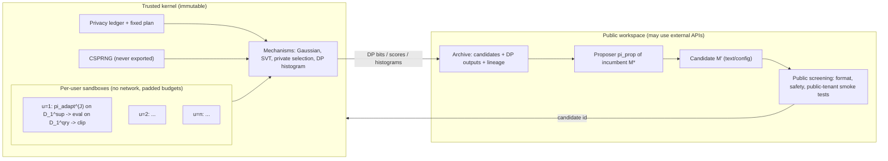

# Learning to Improve from Private Experience
## Differentially Private Recursive Agent Evolution (DP-RAE): research plan

*Version 1.0, 2026-10-02. This plan builds on GPT's framework (see the review in
[01_review_of_gpt_analysis.md](01_review_of_gpt_analysis.md)). Numbers marked
"calibration" come from `analysis/calibration.py`. No LLM experiments have been
run yet. All performance statements are hypotheses.*

---

## 0. Summary

**Question.** Many users or tenants accumulate private experience with an agent.
Can a shared *improver*, the procedure that turns experience into a better
agent, be learned from that experience under a fixed, user-level differential
privacy budget? And can the improver then improve itself?

**Thesis.** Recursive improvement needs rich feedback, and releasing feedback
spends privacy. The useful design space has three parts:

1. Where rich feedback is *consumed*: inside per-user sandboxes, never
   released.
2. What crosses the privacy boundary: a few bounded, aggregated statistics.
3. Which DP mechanism matches the *shape* of an RSI loop: many proposals, few
   accepted upgrades.

**First-paper scope.** The base model is frozen. We evolve prompts, workflow
configuration and rule/skill memory of task agents (level 0), a shared improver
(level 1), and the improver's own proposal routine (level 2). There is no
weight training, and no self-modification of scorers, accounting or the kernel.

**Expected contributions.** Which of these hold depends on the gates in §11.

* **C1 Formulation.** User-level (central) DP for Mode G and joint DP for
  Mode L. The guarantee covers the *entire public trajectory* and holds even
  when the improver code is adversarial.
* **C2 Mechanisms.** A privacy–noise–compute analysis of the mechanisms that
  can drive an RSI loop: release-all, private selection, sparse-vector
  acceptance tests and DP diagnostics. It includes a calibrated rule for
  choosing among them.
* **C3 Benchmark.** MT-Ops, a procedurally generated multi-tenant tool-use
  benchmark. It plants conventions that public priors cannot guess, has a
  tunable public/private overlap and prevalence, and contains canaries. This
  makes it possible to test *whether private feedback matters at all*.
* **C4 Evidence.** Under matched privacy and compute, a DP-trained improver
  beats (a) a fixed improver, (b) public-only search and (c) one-shot DP
  synthetic experience. An evolvable proposer beats a fixed one in
  improvement@k on unseen tenants and task families.
* **C5 Phase diagram.** When private recursive gains survive DP, as a function
  of number of users, ε, convention prevalence and public/private overlap. The
  model predicts a prevalence threshold p\* below which shared conventions are not
  learned, while single-tenant secrets stay protected by the DP guarantee.
  This contribution is publishable whatever the sign of C4.

---

## 1. Motivation and deployment model

### 1.1 Scenario

A vendor runs agents for *n* tenants: enterprise teams, clinics or customer
service desks. Each tenant's agent accumulates experience: tasks, tool calls,
failures and recoveries. Two improvement products are possible:

* **Mode L: shared improver, local personalisation (primary).** The vendor ships
  one improver *M*. *M* runs inside each tenant's boundary and turns that
  tenant's experience into an improved tenant agent, which stays with the
  tenant. The vendor wants to make *M* better using all tenants' experience,
  while guaranteeing that *M*, and everything published while training it,
  reveals almost nothing about any single tenant.
* **Mode G: shared global agent (secondary, DP-ES continuity).** One global
  agent *S* serves everyone and is improved from aggregate private evidence.

### 1.2 Why "privacy by construction" is not enough

Current multi-user self-evolution systems share *distilled artefacts* instead of
raw trajectories. FederatedSkill, for example, shares LLM-distilled skill
patches; Fed-SE shares low-rank adapter updates. Neither gives a formal DP
guarantee. A distilled skill can copy secrets verbatim, such as an approval
code, a customer name or an internal URL, whenever the secret helped solve a
task. **Motivating experiment E6a (§7)** will show this with canaries. It is
cheap and makes the case for formal guarantees concrete.

### 1.3 What DP does and does not buy

* **Protected unit:** one tenant/user's entire experience D_u (add/remove
  adjacency).
* **Protected outputs:** every public artefact. That means all candidate
  agents, improvers and proposers ever generated, the archive, every released
  statistic, logs, and the final versions.
* **Not provided by DP:** confidentiality from the operator of the trusted
  evaluation service (that needs TEE or MPC, which is out of scope); correctness
  of upgrades (measured separately, §7 E8); protection against memorisation
  already present in the base model; protection of data that later agents read
  outside the mechanism.

---

## 2. Problem formulation

### 2.1 Data and public resources

* Private: tenants *u* = 1..*n*, each with experience
  D_u = (D_u^sup, D_u^qry). Tasks come with executable environments and
  verifiers. The support/query split is fixed by public randomness.
* Public: frozen base LLM *f*; public tenants D_pub; tool specifications; a
  public distribution *R* of reference agents (initial agent S_0 and its public
  variants); initial improver M_0; initial proposer, part of M_0 (§2.2).

### 2.2 Objects that evolve (three levels)

| level | object | v1 representation | what it does |
|---|---|---|---|
| 0 | task agent *S* | system prompt, tool-use policy flags, rule/skill memory, small workflow graph | solves tasks |
| 1 | adaptation routine π_adapt (inside improver *M*) | reflection/rule-extraction prompts plus config (J steps, which failures to read, verification policy, memory format, pruning) | S′ = π_adapt(S, experience) |
| 2 | proposal routine π_prop (inside improver *M*) | meta-prompt plus config | proposes the next improver M′ = (π_adapt′, π_prop′) from public info and DP history |

*M* = (π_adapt, π_prop) is a single editable object, as in Hyperagents, so the
improver modifies the procedure that modifies it. **Version 2** may allow
constrained Python with a whitelisted API for both routines.

### 2.3 Objectives

For improver *M*, reference agent *r* ~ *R* and tenant *u*, define the
**local adaptation gain**:

$$ g_u(M; r) = \mathrm{Score}\big(\pi^{M}_{\mathrm{adapt}}{}^{(J)}(r, D_u^{\mathrm{sup}}),\, D_u^{\mathrm{qry}}\big) - \mathrm{Score}(r, D_u^{\mathrm{qry}}) \in [-1, 1].$$

The population meta-objective is $G(M) = \mathbb{E}_{u, r}[g_u(M; r)]$. Paired
comparison against the incumbent M\* uses
$d_u(M', M^{\star}) = g_u(M') - g_u(M^{\star}) \in [-1, 1]$.

For Mode G, the objective of the global agent is
$V(S) = \mathbb{E}_u[\mathrm{Score}(S, D_u)]$.

**Recursion metric.** improvement@k of a proposer, following Hyperagents: the
expected G of the best improver it produces within *k* proposals, starting from
a held-out reference improver, under a fixed privacy and compute budget.

### 2.4 Privacy definitions

* **Mode G, central user-level DP.** The map D ↦ public transcript T is
  (ε, δ)-DP under add/remove of any D_u.
* **Mode L, joint DP.** User *u* additionally receives Out_u = F(T, D_u), its
  personalised agent. The map D ↦ (T, (Out_v)_{v≠u}) is (ε, δ)-DP in D_u.
  This follows from the billboard lemma whenever T is DP and each Out_v depends
  on D only through (T, D_v).

Formal statements, proof sketches and kernel invariants are in
[04_privacy_and_security_spec.md](04_privacy_and_security_spec.md).

---

## 3. Method: DP-RAE

### 3.1 Architecture



* **Public side.** It sees only public data and kernel outputs. Because it never
  touches private data, the proposer may use a strong external model, such as
  the DeepSeek-V3.x model used in DP-ES.
* **Kernel side.** It executes untrusted candidate code on private data, using a
  *local* model (open-weight 7–14B to start). It releases only the outputs of
  mechanisms from a fixed plan.

### 3.2 Inner loop: sandbox meta-evaluation

For each tenant in the evaluation cohort, inside the sandbox:

1. Run the reference agent *r* on D_u^sup and record trajectories.
2. Apply π_adapt for J steps. Each step reads trajectories and outcomes, edits
   the rules, skills and prompt, and re-runs on the support set.
3. Evaluate the adapted agent on D_u^qry and compute g_u, or d_u against the
   incumbent using common random numbers (same tasks, same decoding seeds).
4. Clip to [−1, 1]. Emit **only** this scalar, optionally plus a bounded
   failure-category vector for M4. Everything else is destroyed. Runtime and
   tokens are padded to fixed caps.

### 3.3 Outer loop: mechanisms

| id | mechanism | released per test | privacy cost scales with | compute per test |
|---|---|---|---|---|
| M1 | Gaussian release-all (DP-ES style) | noisy mean of g or d | √(#tests), with subsampling amplification | m users (Poisson) |
| M2 | Private selection (Liu–Talwar / Papernot–Steinke) | winner of a generation (+ noisy score) | #generations; independent of population size | m × K per generation |
| M3 | SVT acceptance test (AboveThreshold) | one bit: d̄ > τ? | #accepted upgrades *c*; independent of #proposals | all users in the cohort |
| M4 | DP diagnostic histogram | noisy sum of clipped failure-category vectors | #histogram releases | free alongside M1/M3 evaluation |

Calibration (n = 1,000, ε = 2, full-population tests). Release-all noise grows
from 0.010 (Q = 20) to 0.122 (Q = 3,000). SVT stays at 0.0085 (c = 3) or
0.028 (c = 10) regardless of Q. With subsampled tests the picture changes
(calibration §F), so **WP1 picks the mechanism by replay**. It does not assume
one.

**Default candidate design (to be confirmed in WP1).** Public screening comes
first and is free. Accepted upgrades go through **M3** with a public margin τ
equal to the minimal meaningful effect and an upgrade budget *c*. A small
**M4** budget feeds the proposer "where improvers fail". There is an optional
**M1** release of the final improver's score for reporting.

```text
DP-RAE (Mode L, SVT variant)
input  : public (R, M0, D_pub), private D_1..D_n, fixed plan Π = (cohort rate γ, c, τ, Q_max, ε_SVT, ε_diag, ε_final)
kernel : K (ledger, CSPRNG, sandboxes, mechanisms)
M* ← M0;  archive ← {M0};  H ← ∅                       # H = public DP history
cohort ← K.poisson_cohort(γ)                           # sampled once; see the amplification note below
K.svt_init(ε_SVT, c)                                   # threshold noise drawn and held inside K
for i in 1..Q_max:
    M' ← M*.π_prop(archive, H, D_pub)                  # public information only
    if not public_screen(M', D_pub): continue          # free
    bit ← K.svt_test(cohort, stat = mean_u d_u(M', M*), threshold = τ)
    H.append((id(M'), bit));  archive.add(M', parent = M*)
    if bit == ⊤:
        M* ← M'
        if ε_diag budget remains: H.append(K.dp_histogram(cohort, M*))
        if K.svt_exhausted(): break
report ← K.gaussian_release(all users, G(M*), ε_final)  # optional
return M*, archive, H, report, K.ledger
```

**Amplification note (amended 2026-10-02).** The cohort is sampled once and
reused by every SVT test and diagnostic histogram. Amplification therefore
applies to the *joint* mechanism run on the cohort:

1. Compose ε_SVT, ε_diag and anything else that touches the cohort into
   (ε_c, δ_c).
2. Amplify once: (log(1 + γ(e^{ε_c} − 1)), γ·δ_c).

Never amplify each mechanism separately, and never use the cohort outside that
joint mechanism. The final report runs on all users and is composed without
amplification.

### 3.4 Recursion

* The incumbent's own π_prop writes the next candidate, *including a new
  π_prop*.
* Proposer quality is credited through its descendants, in the spirit of
  clade-metaproductivity / improvement@k. Credit is computed from DP outputs
  only, so it is post-processing.
* **Ablation:** freeze π_prop = π_prop(M_0). This gives "learning to improve"
  without recursion.
* **Recursion claim:** the evolvable proposer beats the frozen one in
  improvement@k under matched budgets. In addition, the **lineage test** must
  show positive gains across successive accepted generations, not just
  M_T > M_0.

### 3.5 Mode G variant

Candidates are global agents *S*, proposed by the current improver from public
information and DP feedback. Privately meta-evaluating *M* in Mode G would
require nested DP loops. Instead, *M* is selected using the Mode L gain as a
**proxy**, and E2 tests the proxy non-privately on public tenants: it is
accepted if the Spearman correlation between local gain and global improvement
is at least 0.5. If the proxy fails, Mode G is reported only as the DP-ES
continuity baseline.

### 3.6 Guarantees (statements; proofs in 04)

* **Theorem 1 (Mode G).** Under kernel invariants K1–K7, with a fixed plan, the
  public transcript is (ε, δ)-user-level DP. Here (ε, δ) is the composition of
  the plan's mechanisms: RDP/PLD for Gaussian parts, pure DP for SVT with
  amplification, combined by basic composition across parts.
* **Theorem 2 (Mode L).** Under the same conditions, the system is (ε, δ)-joint
  DP (billboard lemma).
* **Proposition 3 (self-modification invariance).** Theorems 1–2 hold for
  *every* sequence of improver programs, including adversarial ones. Candidate
  code affects only *which* bounded statistic is computed, never the release
  channel.
* **Non-claims for v1.** No adaptive budgets (they would need privacy filters
  or odometers). No certificate that every upgrade is a true improvement; that
  is measured in E8.

### 3.7 Positioning

| work | evolvable improver | private multi-user experience | formal DP (unit) | meta-gain / transfer validation | loop-shaped mechanism |
|---|---|---|---|---|---|
| Promptbreeder 2023 | ✓ (mutation prompts) | – | – | – | – |
| STOP 2024 | ✓ (improver code) | – | – | partial | – |
| DGM 2025 / Hyperagents 2026 | ✓ | – | – | ✓ improvement@k, transfer | – |
| HSI 2026 | ✓ (evolver, meta-evolver) | – | – | partial | – |
| REUSE 2026 | – (evaluation protocol) | – | DP-inspired *validity*, not privacy | – | ✓ restricted feedback |
| PE / Aug-PE / MAPLE | – | ✓ (data synthesis) | ✓ sample-level | – | n/a |
| DP-ES 2026 | – | ✓ records | ✓ record-level | – | – (release-all) |
| Fed-SE 2025 / FederatedSkill 2026 | partial (server-side evolution) | ✓ | – | – | – |
| DP meta-learning (Li et al. 2020) | – (gradients) | ✓ tasks | ✓ task-level | – | – |
| **DP-RAE (this plan)** | ✓ (3 levels) | ✓ | ✓ user-level, joint DP | ✓ transplantation, lineage, unseen families | ✓ SVT / selection |

Novelty lies in the **combination** together with the **mechanism analysis**
and the **phase diagram**. No single component is new. See
[03_related_work.md](03_related_work.md) for what each neighbouring work has
already settled.

---

## 4. Research questions and pre-registered hypotheses

Effect sizes are absolute success-rate points on held-out tenants. Δ_min is
fixed before main runs (default 3 pp).

| id | hypothesis | test | falsified if |
|---|---|---|---|
| H0 | Private feedback matters | DP-RAE at ε ≤ 4 vs ε = 0 public-only search (B2) on MT-Ops with overlap ω ≤ 0.5 | gain < Δ_min, or 95 % run-level CI includes 0 |
| H1a | A DP-trained improver improves | G(M_T) vs G(M_0) on held-out tenants, matched budget | same criterion |
| H1b | Recursion helps | evolvable vs frozen π_prop: improvement@k on unseen task family; lineage test | no improvement@k gain, or lineage gains not positive in ≥ 2/3 of transitions |
| H2 | Encapsulation beats stepwise release | sandbox scalar (DP-RAE) vs releasing per-step feedback under the same ε | DP-RAE not better |
| H3 | Interaction beats one-shot synthesis | DP-RAE vs DP synthetic experience + non-private self-improvement (B6), same user-level ε and compute | B6 within Δ_min or better |
| H4 | Loop-shaped mechanisms win | SVT/selection vs release-all at equal ε *and* equal compute, many-proposal regime | no gain in final G or false-promotion rate |
| H5 | Prevalence threshold | conventions with prevalence p < p\* are not learned, and canary exposure stays within what ε permits; above p\* the learning rate rises | no threshold behaviour, or p\* inconsistent with the noise model by > 2× |

**H5's quantitative prediction.** A convention used by a fraction *p* of
tenants raises the mean paired statistic by about p·Δ_conv, where Δ_conv is the
per-tenant gain from knowing it. It is detectable when p·Δ_conv ≳ z·σ_total,
which gives p\* ≈ z·σ_total / Δ_conv. For example, with σ_total = 0.014
(calibration §E, m = 500 of 2,000) and Δ_conv = 0.25, p\* ≈ 0.14. A canary has
p = 1/n, which lies far below p\*, so DP is predicted to suppress it. This
unifies utility and privacy in one testable curve.

---

## 5. Benchmarks and data

### 5.1 MT-Ops: multi-tenant operations sandbox (new; primary)

This is a deterministic simulator with no LLM inside the environment. It is
cheap to scale to thousands of tenants and is released with fixed seeds.

* **Backend.** Relational state (customers, orders, invoices, tickets,
  inventory, schedules) and 10–15 JSON-callable tools (search, get, update,
  create, approve, validate, notify, …). Verifiers check final state and
  required response fields.
* **Task families (≥ 4).** Billing/refunds, account management,
  inventory/scheduling, incident tickets. At least one family is held out for
  transfer tests.
* **Conventions.** The simulator enforces arbitrary but consistent rules. One
  example: "refunds over 200 need `approve(kind="finance")` before `update`".
  Another: "dates in `update_record` must be ISO-8601". Another: "customer IDs
  must be resolved via `search` first". Violations return error codes whose
  *informativeness* is a knob, from verbose text to opaque codes.
  * **Shared pool** of L ≈ 40 rules. Tenant *u* includes rule *l* with
    prevalence p_l. The prevalence profile is a knob: Zipf by default, plus
    uniform.
  * **Tenant-specific rules**, 1–3 per tenant, which only local adaptation can
    learn.
  * **Public/private overlap ω.** This is the fraction of the private rule pool
    that also appears in the public tenants. At ω = 1, public search suffices
    (the DP-ES regime). At ω = 0, only private feedback reveals the rules.
* **Canaries.** Unique per-tenant secrets: names, account numbers, and an
  "approval code" that *helps* solve that tenant's tasks if memorised. Any
  appearance in a public artefact counts as a leak. The canaries also serve the
  one-run audit (E6).
* **Scale.** n up to 5,000 tenants, with 12 tasks each (8 support / 4 query) by
  default.
* **Validity checks in WP0 (amended 2026-10-02 after the v0 audit).** Measure
  every check under the *exact* contract of the LLM experiments: the same
  prompt-visible information, interaction and retry rules, and scoring.
  1. *Split separation.* Public tenants are generated from the ω-restricted
     rule pool; private and test tenants from the full pool.
  2. *Knowledge-free ceiling.* The best scripted policy that uses no rule
     knowledge (e.g. "always A, then correct") stays ≥ 15 pp below the oracle.
  3. *Transfer headroom.* A policy fitted on unlimited private-tenant data beats
     the same policy fitted on unlimited public-tenant data, and the
     tenant-only policy, by ≥ 10 pp. This requires two things: query prompts
     that expose features identifying the governing rule, and query tasks that
     need shared rules the tenant's own support never showed.
  4. *Usability.* The LLM given the true rule table beats the LLM without it by
     ≥ 15 pp.
  5. *Prevalence.* Some shared rules have prevalence at or above the H5
     detectability threshold (≥ 0.15).

  Run strategy-distillation pilots only after all five pass.
  `analysis/headroom_audit.py` implements checks 1–3 for v0. MT-Ops v0 fails
  check 1, fails check 3, and fails check 2 under the interactive contract (see
  `results/headroom_audit.md`).
* **Robustness variant.** A τ-bench-derived version adds tenant-specific policy
  variations to existing retail/airline domains (uses a user simulator; costs
  more).

### 5.2 LaMP: real user boundaries (Mode L validation)

The user-based splits of the LaMP personalisation benchmark provide real
per-user profiles (support) and a held-out query per user. Here the improver is
a *personalisation procedure*: what to retrieve, summarise or extract from a
profile, and how to write the personalised prompt. Use the classification /
ordinal tasks (LaMP-2, LaMP-3) for clean [0,1] scores and one generation task
(LaMP-5 or LaMP-7). A single query per user means a high per-user variance, so
more users are needed. Exact user counts per split must be checked in WP0. The
data are public, so this simulates privacy; real sensitive deployment is out of
scope.

### 5.3 GSM8K with DP-ES (continuity; record-level)

Used only for E0, the ε = 0 and full-batch controls of DP-ES, to anchor the
narrative.

### 5.4 Splits

* public development tenants (convention pool controlled by ω)
* private optimisation tenants
* held-out test tenants, same families
* held-out task family
* (LaMP) held-out users

Records of one tenant never cross splits. **Every** release on private tenants,
including test-set reporting, hyperparameter search, restarts and final
selection, goes into the ledger. Synthetic tenants are generated data, so
replaying on them is free. Real data would not allow that.

---

## 6. Baselines

| id | baseline | rules out |
|---|---|---|
| B0 | S_0 / M_0, no learning | trivial gains |
| B1 | local-only adaptation with M_0 (no sharing) | that sharing is unnecessary (Mode L) |
| B2 | public-only evolution (ε = 0): same pipeline on public tenants | that public priors suffice (the DP-ES lesson) |
| B3 | DP-ES-style fixed improver, release-all (Mode G) | that this is only DP-ES with a bigger search space |
| B4 | DP-Promptbreeder-style co-evolution, scalar release-all (*our adaptation*) | that co-evolution alone suffices |
| B5 | Hyperagent-/DGM-lite with the same isolation and release-all DP scores (*our adaptation*) | that this is "existing self-improver + DP interface" |
| B6 | one-shot DP synthetic experience (PE / Aug-PE / MAPLE-style synthetic *(task, action, outcome)* tuples at the same user-level ε) + non-private self-improvement | that interaction is unnecessary (H3) |
| B7 | FederatedSkill-style skill-patch sharing, no DP | utility reference *and* leakage demonstration |
| B8 | DP-RAE with ε = ∞ | cost of privacy |
| B9 | REUSE-style certified promotion (non-DP) | difference between statistical validity and privacy |
| B10 | private selection returning winner IDs only (M2) | that the mechanism advantage is only a patched scoring interface |

Adapted baselines are labelled as ours. All comparisons use the same privacy
unit (user), the same total (ε, δ), base model, token caps and number of
private user-evaluations. The meta-training cost of every learned improver is
reported.

---

## 7. Experiments

| id | purpose | protocol | primary metrics | decision use |
|---|---|---|---|---|
| **E0** | Does DP-ES learn from private data? | Local Qwen2.5-7B, GSM8K: (a) published DP-ES, (b) ε = 0 (random selection, no private data), (c) full-batch scoring at the same ε; 10 seeds each | test accuracy, Δ(a−b), Δ(c−a) | Narrative; motivates MT-Ops' overlap knob |
| **E1** | Mechanism calibration by replay | Generate a public pool of ~60 improvers (and ~60 task agents). Evaluate each *non-privately* on 600 synthetic tenants to get utility matrices. Replay M1–M4 (and two-stage hybrids) over ε × cohort size × Q × c grids, 1,000s of times, at zero LLM cost | ranking accuracy, regret, false-promotion rate, final G, per-user sd s_d, effect-size distribution | Choose mechanism and plan; update power analysis; first H5 curve |
| **E2** | Is there non-DP meta-gain? | ε = ∞ DP-RAE vs frozen improver, 3 runs; Mode G proxy-validity test on public tenants | G(M_T) − G(M_0); Spearman(local gain, global gain) | **Gate G1** |
| **E3** | Main DP results (Mode L, MT-Ops) | DP-RAE vs B0–B10 at ε ∈ {1, 2, 4, 8, ∞}; n ∈ {500, 1,000, 2,000}; 5 runs for headline cells, replay for dense curves | held-out-tenant success; utility–privacy–compute frontier; information efficiency (private user-evaluations to reach target) | H0, H1a, H2, H3, H4 |
| **E4** | Is it recursive? | (i) Transplantation: M_T vs M_0 from 5 held-out public reference agents, unseen tenants, unseen task family, matched model/tokens/context/privacy. (ii) Frozen vs evolvable π_prop: improvement@k. (iii) Lineage test across accepted generations | Δ_meta(B), improvement@k, lineage gains; meta-training cost | H1b |
| **E5** | Phase diagram | Vary prevalence profile, ω, n, ε, error-message informativeness; replay plus 6–8 live confirmatory runs | learned-rule recovery vs p; p\* vs prediction | H5 |
| **E6** | Privacy audit | (a) FederatedSkill-style leakage demo with canaries; (b) canary exposure scan over the *full* transcript; (c) one-run DP auditing with many inserted canaries (Steinke–Nasr–Jagielski 2023) to lower-bound ε empirically; (d) **adversarial-improver red team**: improvers instructed to exfiltrate through text, timing, errors, token counts | leaks found; empirical ε lower bound vs accountant | Supplementary evidence; the formal guarantee comes from proofs |
| **E7** | External validity | LaMP (Mode L); a second open-weight model family / size; Mode G on MT-Ops | same as E3 | Generalisation of claims |
| **E8** | Upgrade reliability | False-promotion rate (true G from a large non-private oracle evaluation on synthetic tenants) for DP-RAE vs B9 (REUSE-style) vs release-all | false promotions per run; final true G | Positions against REUSE |

---

## 8. Metrics and statistics

* **Independent unit = a full evolution run.** Vary seeds, task order and
  cohort draws. Report means with 95 % CIs from a hierarchical bootstrap over
  runs, then tenants, then tasks.
* **Primary endpoints, fixed in advance:** held-out-tenant success
  (H0 / H1a), improvement@k on the unseen family (H1b), and the H3 contrast.
  Apply a Holm correction across the primary endpoints.
* **Power.** The number of runs per headline cell is chosen from E1/E2 variance
  for a minimal detectable effect equal to Δ_min. Five runs is a starting
  point, not a standard. Per-test user requirements come from the power
  analysis: a 5 pp effect needs about 1,000–1,500 users at ε = 1 with SVT or
  few tests (calibration §D).
* **Frontiers.** Performance vs ε, users and inference cost on the same plot.
  Report private user-evaluations and total tokens separately, because fewer
  private calls does not mean fewer tokens (a lesson from DP-ES).
* **Pre-registration.** Commit hypotheses, endpoints, Δ_min, plans and pivot
  criteria to this repo before E3. Changes go in a dated log.

---

## 9. Implementation plan

Planned layout (future code; this commit contains only the plan and the
calibration):

```text
dprae/
  kernel/          # immutable: ledger, CSPRNG, mechanisms (gaussian, svt, selection, histogram), accountant
  sandbox/         # per-tenant executor: no network, padded caps, sanitised errors, fixed-shape outputs
  agents/          # level-0 agent representation + interpreter
  improvers/       # level-1/2 representation, interpreter, public screening
  loop/            # outer loops (Mode L, Mode G), archive with lineage and provenance
  replay/          # utility-matrix replay engine for E1/E5
benchmarks/mtops/  # generator, simulator, verifiers, canaries
baselines/         # B1–B10
experiments/       # configs (one YAML per run), pre-registration, launch scripts
analysis/          # calibration (this commit), statistics, plots
```

* **Reuse from dp-es.** The `Candidate`, `ScorerConfig` and fixed-release-plan
  ideas, and the accountant tests. Do **not** reuse the shared `random.Random`.
  Kernel randomness comes from `secrets` / OS entropy, and noise from a
  discrete Gaussian or Laplace sampler for deployment-grade runs.
* **Models.** Sandbox: an open-weight 7–14B instruct model with reliable tool
  calling, served with vLLM. Start with Qwen2.5-7B for continuity with the dp-es
  local runs, and move to a larger model if MT-Ops tool use is too weak.
  Proposer: a strong external API model (public side only).
* **Provenance.** Every artefact records its parents, the DP outputs it
  depended on and the ledger state. A static check verifies that no public
  artefact depends on non-DP private data.

---

## 10. Compute and cost budget (estimates; WP0 measures real throughput)

Assumptions: an episode is about 6 LLM calls; one A100-80GB with vLLM serves
about 3,000 episodes per hour for a 7B model. One improver meta-evaluation
costs about 22 episode-equivalents per tenant (J = 3 × 4 support episodes, plus
4 query episodes, plus 3 improver calls; calibration §G), and about 13 with
shorter episodes (J = 2, 3 + 3 tasks).

| item | estimate (A100-hours) |
|---|---|
| E0 DP-ES controls (GSM8K, 30 runs) | ~20 |
| E1 utility matrices (60 improvers × 600 tenants × 22 + agent matrix) | ~300 |
| E2 non-DP pilot (3 runs) + proxy test | ~200 |
| E3 headline runs (~70 runs × ~43 h, 40 private tests × 250-user cohort × 13 episode-eq.) | ~3,000 |
| E4 transplantation, proposer ablation, lineage | ~600 |
| E5 confirmatory live runs | ~400 |
| E6 audits and red team | ~200 |
| E7 LaMP, second model, Mode G | ~800 |
| **Total** | **~5,500 (≈ $8–14k at $1.5–2.5/GPU-h)** |

Proposer API cost is negligible by comparison (a few thousand calls). The main
levers are replay instead of live runs for dense grids, shorter episodes,
cohort subsampling (calibration §E: 500 of 2,000 users per test gives 2× the
noise at ¼ of the compute), and public screening before any private test.

---

## 11. Timeline, work packages and gates

Assumes one lead researcher plus one student or engineer, starting October 2026.

| WP | window | deliverables | gate (all must hold to proceed at full scale) |
|---|---|---|---|
| **WP0 Foundations** | Oct 5 – Nov 15, 2026 | E0; MT-Ops v0; kernel skeleton (ledger, CSPRNG, sandbox, Gaussian/SVT); throughput benchmark; literature refresh (REUSE, Hyperagents, FederatedSkill full texts) | **G0:** the five MT-Ops validity checks of §5.1, measured under the exact LLM contract; sandbox passes information-flow tests |
| **WP1 Calibration** | Nov 15 – Dec 31, 2026 | E1 replay; E2 non-DP pilot; mechanism choice; power update | **G1:** (a) non-DP meta-gain ≥ 5 pp, CI excludes 0; (b) some mechanism at ε ≤ 4, n ≤ 2,000 keeps ≥ 50 % of it in replay; (c) Mode G proxy ρ ≥ 0.5, otherwise Mode G is demoted |
| **WP2 Prototype** | Jan – Feb 2027 | Full DP-RAE; proofs written; audit harness; baselines B1–B10; **preprint #1** (calibration + E0 + leakage demo + mechanism analysis) | **G2:** information-flow audit and red team pass; baselines reproduce |
| **WP3 Main study** | Mar – Apr 2027 | E3, E4, E5 | **G3:** H0 and H1a hold at some ε ≤ 4; transplantation gain survives matched budgets |
| **WP4 Validation & writing** | Apr – mid-May 2027 | E6, E7, E8; paper; code and benchmark release | NeurIPS 2027 submission (deadline usually mid-May; verify), with ICLR 2028 as fallback |

Preprint #1 also protects priority in a field moving month by month (three
directly related arXiv papers appeared in September 2026 alone).

---

## 12. Risks, mitigations and pivot criteria

| risk | likelihood | mitigation | pivot if it materialises |
|---|---|---|---|
| R1 Private signal no better than public priors (as E0 may show for DP-ES) | medium | MT-Ops overlap knob ω; opaque rules | Phase-diagram / negative-result paper: "when can agents learn from private experience?" |
| R2 No non-DP meta-gain (G1a fails) | medium | Iterate improver design (memory format, verification policy); larger model | Drop recursion; study DP learning of task agents only |
| R3 Too few users for power | medium | Synthetic scale; restrict claims to effects ≥ MDE; LaMP | Report MDE-bounded conclusions |
| R4 Compute overrun | medium | Replay, shorter episodes, cohort subsampling | Cut E7 scope; keep E0–E5 |
| R5 Scooped (Hyperagents / REUSE follow-ups, FederatedSkill + DP) | medium–high | Early preprint #1; emphasise formal user-level DP + mechanisms + phase diagram | Lean into the parts others lack |
| R6 Privacy implementation bug | low–medium | Kernel isolation, provenance checks, one-run audits, external review | Re-run affected results; disclose |
| R7 Weak tool use in 7B models | medium | 14–32B open models; simplify tool schemas | Fewer tools, more families |
| R8 Benchmark bias toward our method | medium | Pre-registration; LaMP real data; τ-bench variant; open-source generator; fair B6 | Report per-benchmark results only |

**Pre-registered stopping rules** (adopted from GPT, made quantitative):

* No transferable meta-gain at ε = ∞ (G1a fails) → fix the improver before
  adding privacy.
* DP-RAE does not beat B4 or B6 by Δ_min → no claim based on system
  complexity.
* Gains vanish after resetting the start point and matching context and compute
  → claim task optimisation only, not RSI.
* Gains appear only at ε > 8 → report as an applicability boundary, not as
  deployable.

---

## 13. Outcome scenarios and the paper each supports

| scenario | rough subjective probability | paper |
|---|---|---|
| H0 + H1a + H1b + H3 hold at ε ≤ 4 | 0.20–0.30 | Main track (NeurIPS/ICLR): *Learning to Improve from Private Experience* |
| H0 + H1a hold; H1b or H3 fails | 0.25–0.35 | Main track or TMLR: *DP meta-learning of agent improvers*, with honest limits on recursion |
| H0 fails at realistic ε, but phase diagram, mechanisms and leakage demo are solid | 0.25–0.35 | SaTML / TPDP / workshop + journal: *When can agents learn from private experience?* |
| Infrastructure or benchmark problems block results | ≤ 0.1 | Preprint #1 only |

These are judgement calls, not estimates from data. Some publishable output
looks likely (~0.8). A strong main-track result is a minority outcome, which is
why the plan stages investment behind gates.

---

## 14. Feasibility and potential

| dimension | assessment |
|---|---|
| Formal guarantee | **High.** Correct application of sensitivity, composition, amplification and the billboard lemma, with mechanical proofs |
| Engineering | **Medium–high.** Kernel and sandbox isolation is the main work; DP-ES gives a starting point |
| Core empirical claim (DP meta-gain that transfers) | **Uncertain (medium–low).** Hinges on G1; E0 and E1 resolve the uncertainty cheaply |
| Novelty | **Moderate.** Combination plus mechanism analysis plus phase diagram; no single component is new |
| Impact if positive | **High.** First formal answer to "can shared agent improvers learn from private user experience?", directly relevant to products such as FederatedSkill-style systems |
| Cost | ~5.5k GPU-hours and 6–8 person-months for paper 1 |

**Recommendation.** Proceed, but treat WP0–WP1 (about 3 months, about 500
GPU-hours) as a funded feasibility study with hard gates. The cheapest,
highest-information steps come first:

1. **E0**: DP-ES ε = 0 control. One GPU-day.
2. **MT-Ops G0 check**: does the benchmark contain private-only learnable
   structure?
3. **E1 replay and E2**: is there a meta-gain, and does it survive the noise
   levels the user count permits?

---

## Appendix A: Notation

| symbol | meaning |
|---|---|
| n, m, γ | tenants; tenants per private test; cohort sampling rate |
| D_u = (D_u^sup, D_u^qry) | tenant *u*'s private experience |
| S, M = (π_adapt, π_prop) | task agent; improver (adaptation and proposal routines) |
| g_u, d_u, G | local adaptation gain; paired difference; population meta-objective |
| Q, c, K, G_ev | private tests; accepted upgrades (SVT cutoff); candidates per generation; selection events |
| τ, Δ_min | public SVT margin; minimal meaningful effect |
| ω, p_l, p\* | public/private rule overlap; rule prevalence; detectability threshold |

## Appendix B: Open questions to settle in WP0

1. LaMP user counts per user-based split and licence terms; choice of tasks.
2. Whether REUSE's guarantee can be instantiated with DP-RAE's SVT outputs (for
   a direct E8 comparison).
3. RDP analysis of Gaussian SVT (Zhu & Wang 2020) and Papernot–Steinke
   selection: implement and validate before use, since these would tighten C2.
4. Whether a TEE-backed sandbox is in scope for a "provider must not see data"
   variant (default: no; stated as a limitation).

## Appendix C: Amendments log

| date | amendment | reason |
|---|---|---|
| 2026-10-02 | Cohort amplification applies once to the composition of all mechanisms sharing the cohort (§3.3, spec Lemma 2) | The original pseudocode reused one cohort for SVT and histograms without saying so |
| 2026-10-02 | G0 redefined as five contract-level validity checks (§5.1, §11) | The v0 audit showed that the first real-agent pilot could not detect a meta gain by construction (`docs/05_review_of_wp0_progress.md`) |
| 2026-10-02 | Pilot analyses use the seed (one pair of distilled strategies) as the unit: t-interval plus hierarchical bootstrap | The pooled tenant bootstrap ignores between-strategy variance |
| 2026-10-02 | G1's 5 pp threshold is unchanged | Gates are not relaxed after seeing data; the contract changes instead |
